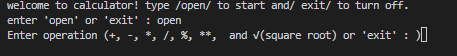
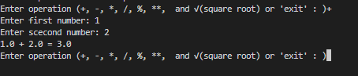

# 🧮 Python Calculator


A simple **command-line calculator** built with **Python 3**. It supports basic arithmetic operations, percentages, powers, and square roots.
## Table of contents
[](#-technologies️)
[](#-features)
[](#-structure)
[](#file-description)
[](#-installation)
[](#-what-i-learned)
[](#-roadmap)
[](#example-output)
[](#-author)
[](#-screenshots)


## ✨ Features

- ➕ Addition
- ➖ Subtraction
- ✖️ Multiplication
- ➗ Division
- 📊 Percentage
- ** Power
- √ Square Root
- 🔄 Restart with `open`
- 🛑 Exit with `exit`


## 📁 Structure

```text
Python-Calculator/
│   .env.example
│   .gitignore
│   main.py
│   README.md
│
└───pictures
        p1.png
        p2.png

```

## File Description
|File | Descriptin|
| --- | --- |
| `main.py` | main file used to run calculatore
| `.env.example` | shows the envoirment variables needed by the project
| `.gitignore` | tells git switch files and folders shold not be tracked
| `README.md` | contains the project documantation
| pictures/ | stores project screenshots


## 📥 Installation
1. open a terminal in the project folder.
2. check the python is installed:
```bash
python --version
```
3. if you don't have `Python 3.13.5` installed:
<details>
<summary>
  
</summary>

<br>

1. Enter the official Python 3.13.5 page :
    - [python_website](https://www.python.org/downloads/release/python-3135/?utm_source=chatgpt.com)
2. Go down to the Files section.
3. If your Windows is a regular 64-bit, click `Windows installer (64-bit)` This is the same option that Python `Recommended` introduced.
4. Open the `file.exe` downloaded .
5. On the first installation page, tick select `Add python.exe to PATH`
6. select `Install Now`
7. After installation, open CMD or Terminal: 
```bash
python --version
```
</details>


<details>
<summary>
  
</summary>

<br>

1. Enter the official Python 3.13.5 page :
    - [Download Python 3.13.5 for macOS](https://www.python.org/downloads/release/python-3135/?utm_source=chatgpt.com)
2. Go down to the Files section.
3. for Mac, download the macOS installer with the .pkg extenions.
4. Open the downloaded file and continue with the installation:.
    - Continue/ Agree/ Install
5. After installation, open CMD or Terminal: 
```bash
python --version
```
</details>

## 🛠️ Technologies

- `Python 3.13.5`
- `while` loops
- `if / elif / else`
- User input and arithmetic operators

## ▶️Usage
1. open a terminal in the project folder. 
2. run the `main.py`
3. choose `open` or `exit` for the star or turn of:
4. if you choose `open` enter the operation:
   1. enter your numbers
   2. final see your results
5. if you choose `exit` culculatore turned off.

```bash
python calculator.py 
```

## Example output
```text
    welcome to calculator! type /open/ to start and/ exit/ to turn off.
    enter 'open' or 'exit' : open
    Enter operation (+, -, *, /, %, **,  and √(square root) or 'exit' : )*
    Enter first number: 6
    Enter scecond number: 8
    6.0 * 8.0 = 48.0
```
## 📷 ScreenShots
### start culculatore


### operation



## 🎯 Roadmap
- [x] Add mutiple operation
- [x] Ability to exit the cuculatore
- [ ] Adding `sin, cos, tan, cot` calculation.


## 👩‍💻 Author

Create by [Nooshika Fallah](https://github.com/Nooshika88)

